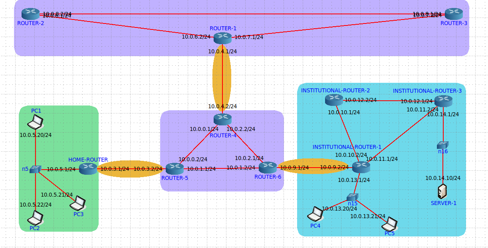

# Atraso, Vazão/Gargalos, Perdas

O trabalho 1 foi elaborado de acordo com o [solicitado](https://github.com/fernandabucheri/redes-de-computadores/blob/master/Trabalho%201/trab_1_2021.pdf).

O objetivo deste trabalho foi implementar uma rede no emulador _CORE_.

## Contextualização
Em uma visão macro, segundo J. Kurose, a Internet é uma rede (complexa) composta por interconexões de
redes. Tal interconexão se dá entre Redes de Acesso e Redes Núcleo. Nas Redes de Acesso estão localizados
os sistemas finais que disponibilizam serviços (aplicações servidoras), os sistemas que consomem serviços
(aplicações clientes), os enlaces de acesso (guiados e não-guiados) de diferentes tecnologias de transmissão.
Há diversos tipos tipos de redes de acesso, como redes institucionais, redes residências, redes móveis de
operadora de telefonia, redes de sensores/IoT, entre outros.

Já nas Redes de Núcleo (da Internet) estão localizados os provedores ISPs _(Internet Service Providers)_. As
redes de núcleo são compostas, tipicamente, por roteadores conectados tanto aos roteadores de borda das
redes de acesso quanto aos roteadores de outros ISPs. A infraestrutura dos ISPs, muitas vezes chamada de
PoP _(Point of Presence)_, é a infraestrutura que permite o acesso aos usuários, sendo composta, tipicamente,
por equipamentos de telecomunicações (roteadores, comutadores, multiplexadores) e servidores AAA
_(Athentication, Authorization, Accounting)_. Os enlaces que conectam os ISPs costumam ser implementos por
fibras óticas. Cabos submarinos de fibra ótica fazem conexão intercontinental de provedores.

Tanto as redes as acesso quanto as redes de núcleo são denominadas AS _(autonomous system)_, “sistemas
autônomos”, pois possui um domínio administrativo independente e, principalmente, um gerenciamento e
operação de rede próprio. Nesse caso, um AS possui sua própria rede física (topologia) e rede lógica (IP),
onde as sub-redes endereçadas estão conectadas por roteadores internos, sob um protocolo de roteamento
intra-AS.

<br>

## Topologia 
Utilizando o emulador _CORE_, definimos e implementamos uma topologia de rede para representar a visão macro da Internet exposta acima.



As redes em roxo são redes de núcleo. Já a rede em verde é uma rede doméstica enquanto que a rede em azul é uma rede institucional. 

<br> 

## Sobre gargalos 

Posteriormente, utilizando a topologia implementada, foram realizados testes de acordo com o solicitado. Os possíveis gargalos ocorrem nos provedores de internet respeitando os menores valores de banda. 

<br>

## Sobre Atrasos

Existem basicamente quatro tipos de atrasos que podem ocorrer a cada salto que os pacotes fazem para percorrer o trajeto entre o nó de origem e nó de destino. 
* Atraso de transmissão: tempo gasto para enviar todos os bits de um pacote para o meio físico de transmissão e tem a ver com a taxa de transmissão contratada com o provedor;
* Atraso de propagação: tempo que apenas um bit leva para percorrer o meio físico de transmissão e tem a ver com a tecnologia utilizada nesse meio físico;
* Atraso de processamento nodal: tempo de processamento do pacote (onde é verificado se o pacote possui erros e etc);
* Atraso de enfileiramento: tempo que o pacote espera na fila para ser transmitido.

No núcleo da rede a comunicação entre os roteadores costuma ser bem rápida já que os links contratados geralmente são de alta velocidade e o meio física costuma utilizar uma tecnologia avançada. Já os clientes e servidores podem ter links de comunicação mais lentos, dependendo da taxa de transmissão que foi contratada dos provedores de acesso e da tecnologia utilizada no meio físico. 

Portanto conclui-se que todos os quatro tipos de atrasos citados estão propensos a acontecer na topologia elaborada, sendo que os atrasos de transmissão e de propagação tem mais chances de ocorrer na comunicação entre os clientes residenciais com o núcleo da rede e na comunicação entre o núcleo da rede com os servidores na rede institucional.

<br>

## Sobre Perdas

Realizou-se testes com a ferramenta _Iperf_ utilizando transmissões UDP _(user datagram protocol)_.

<br>

## Comandos 

Para a realização dos testes sobre atrasos, vazão/gargalos e perdas utilizou-se os seguintes comandos: 

1) Teste de vazão da transmissão fim-a-fim:

Servidor TCP:
```
# iperf -s -i <intervalo>
```
Cliente TCP:
```
# iperf -c <ip_servidor> -r
```
No servidor UDP:
```
# iperf -s -u -i <intervalo>
```
No cliente TCP:
```
# iperf -c <ip_servidor> -r -u
```
Parâmetros importantes:

-c: operação do IPERF como cliente.

-r: medição de desempenho nos dois sentidos (upstream e downstream).

-t: tempo de execução do cliente em segundos.

-u: transmissão sobre UDP.

-i: intervalo em segundos para exposição das métricas de saída.

<br>

2) Teste latência e disponibilidade do nó alvo:

* Ping
```
# ping <ip_maquina_destino>

# ping -M do -s <MTU> <ip_maquina_destino>
```
Parâmetros importantes:

-M: do não fragmenta o pacote.

-s: tamanho do pacote/MTU em bytes.

* Traceroute
```
# traceroute <ip_maquina_destino>
```