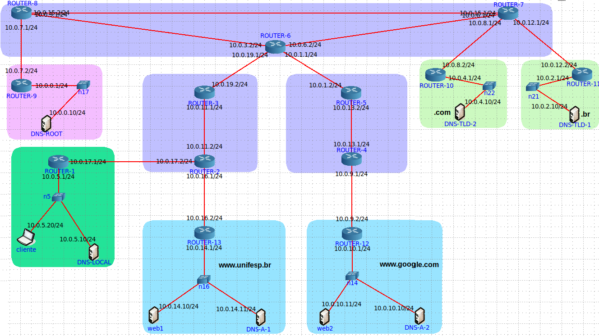

# DNS e Aplicações na Internet

O trabalho 2 foi elaborado de acordo com o [solicitado]().

## Contextualização

Em uma visão macro, segundo J. Kurose, a Internet é uma rede (complexa) composta por interconexões de
redes. Tal interconexão se dá entre Redes de Acesso e Redes Núcleo. Nas Redes de Acesso estão localizados
os sistemas finais que disponibilizam serviços (aplicações servidoras), os sistemas que consomem serviços
(aplicações clientes), os enlaces de acesso (guiados e não-guiados) de diferentes tecnologias de transmissão.
Há diversos tipos tipos de redes de acesso, como redes institucionais, redes residências, redes móveis de
operadora de telefonia, redes de sensores/IoT, entre outros.

Já nas Redes de Núcleo (da Internet) estão localizados os provedores ISPs (Internet Service Providers). As
redes de núcleo são compostas, tipicamente, por roteadores conectados tanto aos roteadores de borda das
redes de acesso quanto aos roteadores de outros ISPs. A infraestrutura dos ISPs, muitas vezes chamada de
PoP (Point of Presence), é a infraestrutura que permite o acesso aos usuários, sendo composta, tipicamente,
por equipamentos de telecomunicações (roteadores, comutadores, multiplexadores) e servidores AAA
(Athentication, Authorization, Accounting). Os enlaces que conectam os ISPs costumam ser implementados
por fibras óticas. Cabos submarinos de fibra ótica fazem conexão intercontinental de provedores.

Tanto as redes de acesso quanto as redes de núcleo são denominadas AS _(autonomous system)_. Os “sistemas
autônomos” possuem um domínio administrativo independente e, principalmente, um gerenciamento e
operação de rede próprio. Neste caso, um AS possui sua própria rede física (topologia) e rede lógica (IP),
onde as sub-redes endereçadas estão conectadas por roteadores internos, sob um protocolo de roteamento
intra-AS.

O protocolo DNS _(Domain Name System)_ é um protocolo de Camada de Aplicação cuja função é essencial para qualquer aplicação na Web. Nele, há uma hierarquia definida para gerenciar de forma distribuída os
nomes na Internet. Considere como exemplo o nome totalmente qualificado (_Fully Qualified Domain Name – FQDN)_:

<center>
www.google.com.
</center>

O segmento www no nome significa um sub-domínio/serviço local à organização google, o qual está
registrado sob o domínio de autoridade .google, que por sua vez está registrado sob o domínio de nível
superior denominado .com.

Na hierarquia de nomes, um conjunto de servidores raízes _(root domains)_ são responsáveis por todo o
domínio de raiz, ou seja, a partir deles é que são registrados os domínios de alto nível _(top level domains - TLD)_. Os servidores TLDs então são responsáveis pelos registros dos últimos segmentos dos nomes, ou seja,
neste exemplo, há um servidor responsável pelo domínio ```.com```, o qual é registrado em um servidor raiz e
registra nomes de servidores de autoridade. Os servidores de autoridade, por sua vez, são responsáveis pelos
registros de domínios de organizações/instituições. No exemplo, há ao menos um servidor responsável pelo
domínio ```.google```, próprio da referida instituição, onde os sub-domínios/serviços como ```www```, ```maps```, ```mail```, etc, estão registrados. Finalmente, os servidores DNS locais são servidores responsáveis por receber
as consultas de resolução de nomes dos clientes. Esses servidores geralmente não registram nomes, tendo
como principal tarefa tratar as consultas dos clientes, ou seja, receber a consulta do tipo A do cliente,
percorrer a hierarquia DNS a partir de um servidor raiz, realizar o _cache_ do nome consultado e, finalmente,
encaminhar as respostas obtidas ao cliente requisitante.

## Topologia 




A topologia elaborada inclui:

* ASs de núcleo de borda, representando diferentes ISPs e redes de acesso, respectivamente.
* Servidores da hierarquia DNS para resolver ao menos dois FQDN que pertençam a domínios
diferentes tanto em nível de TLD quanto de Autoridade. Cada servidor deve estar localizado em uma rede própria de acesso.
* Um servidor de aplicação que pertença a cada um dos domínios de autoridade definidos. Note que o ambos servidor DNS de autoridade e servidor de aplicação geralmente estão localizados no mesmo
AS.
* Ao menos uma rede acesso contendo um servidor DNS local e um cliente.

<br>

## Aplicação cliente-servidor
Utilizando a API de sockets foi implementado uma aplicação cliente-servidor, sendo que, como a aplicação é distribuída, a parte cliente da aplicação roda no nó cliente,
enquanto a parte servidora no respectivo nó servidor.

Algumas observações: 
* O protocolo de transporte escolhido foi o TCP, pois a aplicação lê arquivos que estão no servidor e transmite os dados para o cliente e tal protocolo garante a integridade e ordem dos dados. 
* O cliente se comunica com o servidor sempre a partir do nome do servidor, nunca pelo IP do servidor.

