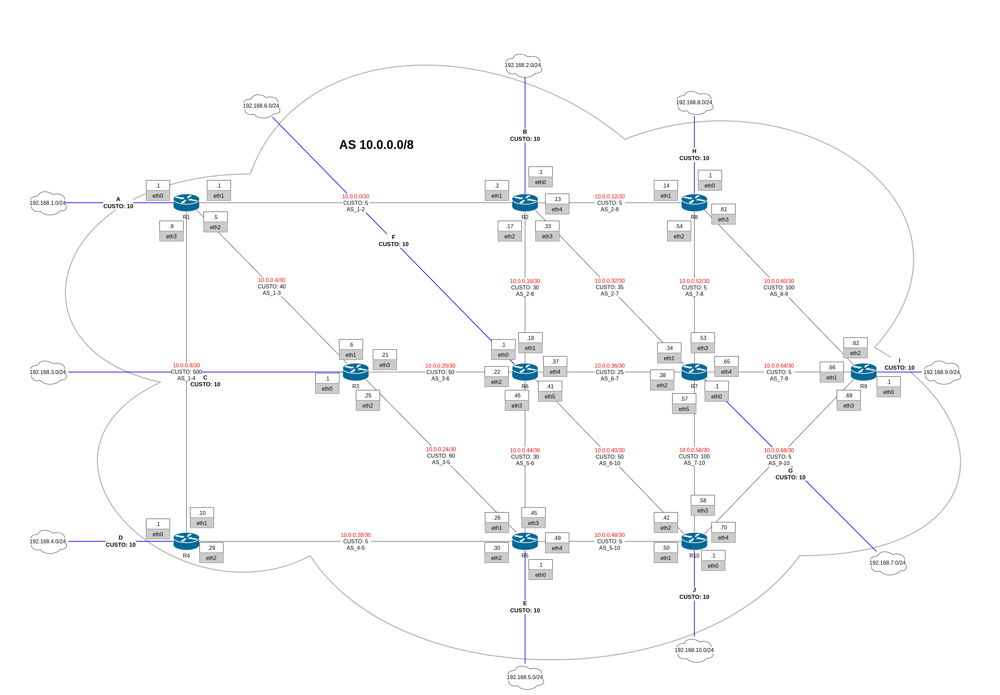
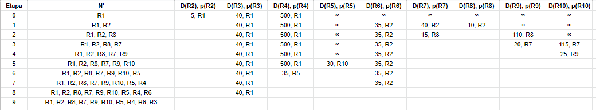

# Roteamento OSPF

O trabalho 3 foi elaborado de acordo com o [solicitado](https://github.com/fernandabucheri/redes-de-computadores/blob/master/Trabalho%203/trabalho_3_roteamento.pdf).

## Topologia 



Inicialmente elaborou-se uma topologia para um AS, com 10 roteadores. Posteriormente definiu-se os pesos (métricas) para os enlaces.

<br>

## Algoritmo de estado de enlace (Dijkstra)
O roteador R1 foi escolhido como nó-roteador de origem e, utilizando o algoritmo de estado de enlace (Dijkstra), montou-se a tabela de iterações para determinar os caminhos de menor custo de S para os demais nós da rede.



<br>

## Implementação do AS no emulador Netkit-NG

No emulador _Netkit-NG_ configurou-se:
* A topologia física (domínios de colisão - enlaces) entre os nós; 
* A rede lógica (definição de endereçamento IP das redes e das interfaces dos nós, bem como as máscaras de sub-rede escolhidas);
* Cada um dos roteadores com o protocolo OSPF. 

Além disso, utilizou-se a ferramenta ```traceroute``` para mostrar o caminho de R1 para os demais nós do AS.

<br> <br>

## Instalação do Netkit-NG no Linux

1) Acesse https://netkit-ng.github.io/ e baixe os arquivos:
* Netkit-NG core 3.0.4:
    * netkit-ng-core-32-3.0.4.tar.bz2
* Sistema de arquivos 7.0:
    * netkit-ng-filesystem-i386-F7.0-0.1.3.tar.bz2
* Kernel 3.2:
    * netkit-ng-kernel-i386-K3.2-0.1.3.tar.bz2

2) Descompacte os arquivos:
Abra o terminal, em ```/home/usuario/```, e dê os comandos:
```
$ tar -xjSf netkit-ng-core-32-3.0.4.tar.bz2

$ tar -xjSf netkit-ng-filesystem-i386-F7.0-0.1.3.tar.bz2

$ tar -xjSf netkit-ng-kernel-i386-K3.2-0.1.3.tar.bz2
```

3) Configure as variáveis de ambiente:
Abra o arquivo ```/home/usuario/.profile``` com um editor de texto e na ultima linha insira as
configurações das variáveis de ambiente do NetKit:
```
export NETKIT_HOME=/home/usuario/netkit

export MANPATH=:$NETKIT_HOME/man

export PATH=$NETKIT_HOME/bin:$PATH
```
4) Exporte as variáveis de ambiente:
Abra o terminal e, na sua ```/home/usuario/``` dê o comando:
```
$ . .profile
```
5) Verifique as configurações do Netkit:
Abra o terminal e, em ```/home/usuario/netkit/```, execute o script:
```
$ cd $NETKIT_HOME

$ ./check_configuration.sh
```
O comando acima vai apontar dependências. Caso sejam verificados que outros pacotes precisam
ser instalados (na máquina real), dê o comando no terminal:
```
$ sudo apt-get install <nome_pacote>
```